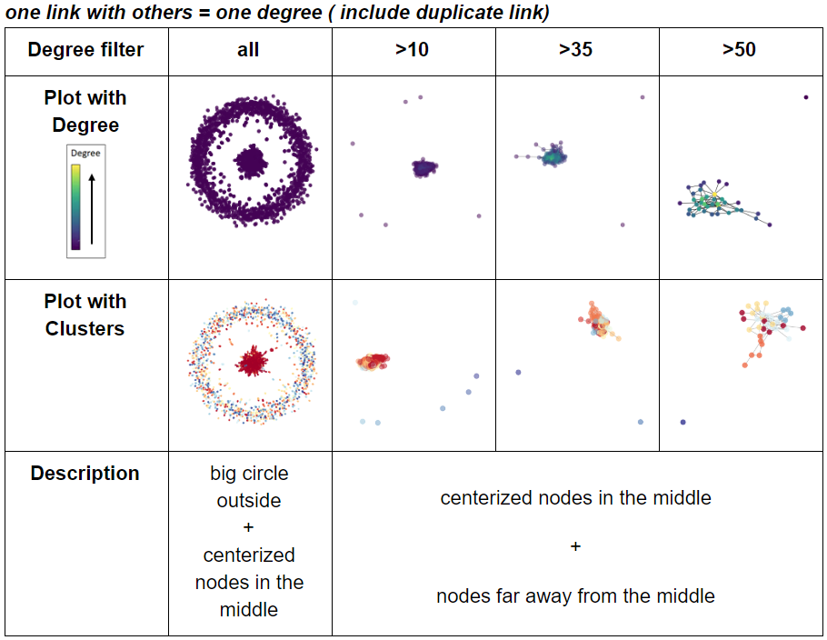
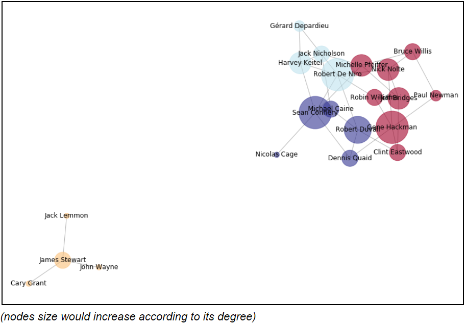

# Social-Network-of-Movie-Stars-on-IMDB
It's a social network analysis for stars and directors on IMDB website. 
I am curious about if there’s a social network in the movie world. Thus, I want to do the analysis with real data online.
I chose the movie and link data inside data below for analysis: 
https://grouplens.org/datasets/movielens/20m/

There are two data for my analysis.
### 1. Web Scraping
In this part, I would show how I select action movies and do web scraping of action movies on IMDB website.

### 2. Social Network of Stars and Directors in Action Movies
For the second part, I will show you the way I do preprocessing for the data I've scraped online. Then, I would show the visualization of social network and the clustering of social network. 
#### Comparing results with different degrees

#### One of Network Result of stars with details

##### If you want to see the result of my analysis, here is the link 🔽
https://drive.google.com/open?id=1u9afC8qKfKhBgOp9t7k3qUu2lgZH9xsYEQM5pdg2Ff8
